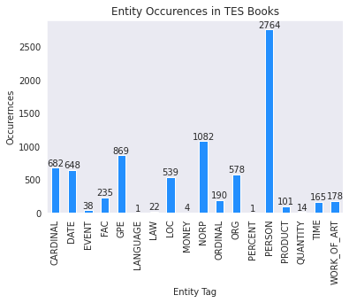
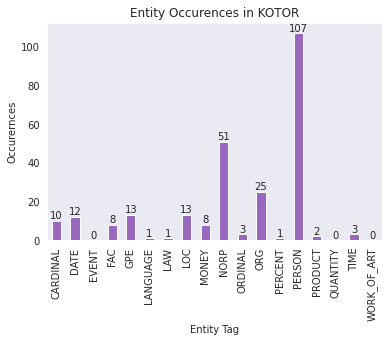
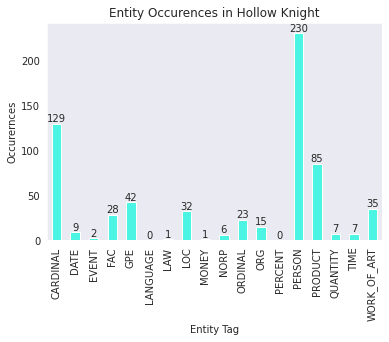

# Final Report:
***
[Alejandro Ciuba](https://alejandrociuba.github.io), alc307@pitt.edu
***
## Summary
This `final_report.md` file contains in-detail descriptions of the process I went through for getting, cleaning, and exploring the data. As well as where I try to draw conclusions given my findings.
### Table of Contents
1. [Introduction](#introduction)
    * [Opening](#opening)
    * [History of The Repository](#history-of-the-repository)
2. [The Questions](#the-questions)
    * [Why I Selected What I Did](#why-i-selected-what-i-did)
    * [What Conclusions Can I Draw?](#what-conclusions-can-i-draw)
3. [Data-Sourcing & Clean-Up](#data-sourcing--clean-up)
    * [The Original Repository](#the-original-repository)
    * [The Hollow Knight Data](#the-hollow-knight-data)
4. [Analysis](#analysis)
    * [Overview of the Games](#overview-of-the-games)
    * [How Are Orders & Requests Realized in Video Games?](#Q1)
    * [What Is the Frequency & Usage of the 2nd Person Pronoun?](#Q2)
    * [What Are Some Common Named Entities in Video Games?](#Q3)
5. Conclusion
6. Bibiography
***
## Introduction
### Opening
Video game corpora are surprisingly hard to find. For an industry that had a global revenue of over 150 billion dollars in 2019, and with multiple billion dollar companies creating games which are played by millions of people worldwide ([Dobrilova, 2022](https://techjury.net/blog/gaming-industry-worth/)), the linguistic research conducted on the media is extremely sparse, and public linguistic data even more so. It is an artistic medium which is rife with linguistic research waiting to be done. The research in this repository set out to answer these questions:

1. How are orders/requests realized in video game dialogues? 
2. What is the frequency and usage of the 2nd person pronoun, you? 
3. What are some common named entities in video games?

Note that the research ended up being more exploratory and that, while these questions were answered, they were so on a _per-game_ basis and a larger dataset would be necessary to draw conclusions about the medium as a whole. While the research completed in this repository may be small and only focused on a small set of video games, it is still a starting point for what could be more-developed linguistic research in the future—especially for pragmatics. 
### History of The Repository
The repository’s original research was slightly different. In the beginning, I had set out to answer various [sociolinguistic questions](https://github.com/Data-Science-for-Linguists-2022/Pragmatics-In-Video-Games/tree/aff36d937302643f623fbc6e64fd6d98d0260181/README.md) related to video games; I was particularly interested in the fantasy-race sociolinguistics found in The Elder Scrolls—a game I had in my dataset. However, these questions ended up being too broad for me to answer and I felt like I lacked the proper time and knowledge needed to tackle them adequately. Ultimately, it was _what_ I wanted to research given my data that caused the most headaches, with frequent changes and refinements made to the research questions. Questions were added, dropped, added again, dropped again, and altered during the beginning phases. It was not until I made [`research.ipynb`](https://nbviewer.org/github/Data-Science-for-Linguists-2022/Pragmatics-In-Video-Games/blob/main/notebooks/research.ipynb) that I got a true sense of what I should do and what questions I could/wanted to answer.

While most of the issues lied in what I should answer, there still were slight problems in other departments. For example, I had wanted to examine the use of deixis in video game quest dialogue, but creating a [script](https://github.com/Data-Science-for-Linguists-2022/Pragmatics-In-Video-Games/blob/main/scripts/brown_deictic_extractor.py) which could accurately identify such a phenomena was out of my grasp. This question ultimately ended up being dropped in favor of my current question about orders and requests in video games. I thought this would be a better fit because it would be easier to identify false positives in the data. Now it was a question of how to answer it, which I quickly realized was a big issue. While I could turn common order and request phrases into regular expressions using Python’s [`re`](https://docs.python.org/3/library/re.html) package, I quickly discovered, however, that I would need way more linguistic context for some (more on that in the analysis section), which then led me down a rabbit hole learning [_spaCy_](https://spacy.io). Learning _spaCy_ honestly took the biggest chunk of time and also contributed way more to the research than I expected. I cannot say this was a bad thing at all, as I absolutely loved learning it.
***
## The Questions
### Why I Selected What I Did
As previously mentioned, I originally wanted to answer various sociolinguistic questions regarding the video games I had at my disposal. However, these plans changed. With first question:

1. _How are orders/requests realized in video game dialogues?_ 

I wanted to try to examine in what ways do video games drive the player to complete what they want/need them to. For example, if a player needs to go somewhere, how does the game (or the game’s characters) tell the player to head over there? Do they try to frame it in a way that gives the player more adjacency?
	
For the second question:

2. _What is the frequency and usage of the 2nd person pronoun, you?_
I wanted to see how often the game refers to the player. I wanted to also see how often games use other pronouns and if the context of the text affects this.

Lastly, in the third question:

3. _What are some common named entities in video games?_

I wanted to examine what type of named entities are common in the games I had. Do they mention people frequently, what about places? Can these entities be used in more than one context (i.e. toponyms)?
### What Conclusions Can I Draw?
All of my analysis will be done on a _per-game_ basis. This means, while I may compare the games I have between each other, I will not make assumptions on all games or even all games in any given genre. This is mainly because the dataset I am working with is extremely small and (particularly with anything which uses ML models) there are some false positives and false negatives which might slightly bias the data.
***
## Data-Sourcing & Clean-Up
### The Original Repository
I did not obtain most of this data from scratch. In fact, all of the data from _The Elder Scrolls Series_, _Star Wars: Knights of The Old Republic_, and _Torchlight II_ were gotten by [Judith van Stegeren](https://judithvanstegeren.com) for their paper, [_Fantastic Strings and Where to Find Them: The Quest for High-Quality Video Game Text Corpora_](https://judithvanstegeren.com/assets/2008-vanstegeren2020fantastic-preprint.pdf), where they explore various ways of obtaining workable video game text corpora.

The data they had gotten from the games was in a really good state. All I had to do was look through each of the dataframes they had made and adapt what was in them, which was all done in [`initial_data_exploration.ipynb`](https://nbviewer.org/github/Data-Science-for-Linguists-2022/Pragmatics-In-Video-Games/blob/main/notebooks/initial_base_data_exploration.ipynb). This mostly involved just reorganizing the columns and dropping unnecessary data, as well as adding word counts to each dataframe. However, I needed to parse the book titles from the URLs in the original [_Elder Scrolls_](https://nbviewer.org/github/Data-Science-for-Linguists-2022/Pragmatics-In-Video-Games/blob/main/notebooks/initial_base_data_exploration.ipynb#The-Elder-Scrolls-Data) data and some columns in the [_Torchlight II_](https://nbviewer.org/github/Data-Science-for-Linguists-2022/Pragmatics-In-Video-Games/blob/main/notebooks/initial_base_data_exploration.ipynb#Torchlight-Data:) and [_Star Wars: Knights of the Old Republic_](https://nbviewer.org/github/Data-Science-for-Linguists-2022/Pragmatics-In-Video-Games/blob/main/notebooks/initial_base_data_exploration.ipynb#Star-Wars:-Knights-of-The-Old-Republic) data frames had to be standardized.
### The Hollow Knight Data
After reading their paper, I was able to use a couple of their techniques to get the script data from _Hollow Knight_. I was lucky enough to have found an extremely well made [fan-written script](https://docs.google.com/document/d/1oaED7I6xL5NItD-wKyDB455f58d3weLz8OMIkRyEQlo/edit#heading=h.wgd1af4mikjx) containing all of the text from the game. I then used my [`HDialogueParser.py`](https://github.com/Data-Science-for-Linguists-2022/Pragmatics-In-Video-Games/blob/main/scripts/HDialogueParser.py) script on an HTML version of the file to parse the characters and a dump of their dialogues throughout the game and put them into a dataframe. The section for _Hollow Knight_ in [`initial_data_exploration.ipynb`](https://nbviewer.org/github/Data-Science-for-Linguists-2022/Pragmatics-In-Video-Games/blob/main/notebooks/initial_base_data_exploration.ipynb#Hollow-Knight) is mostly just me doing some quick renaming and adding word counts.
***
## Analysis
### Overview of the Games
Before going through each question in-detail, it’s important to give a brief overview of each game in the dataset, discussing their genre, main themes, and what the data from the game pertains to and how it relates to the game as a whole. In doing this, it’ll be easier to contextualize the data and understand why the results given are the way they are.

First, the biggest dataset is that from _The Elder Scrolls Series_, a series of [single-player role-playing](https://en.wikipedia.org/wiki/Role-playing_game#:~:text=Single-player%20role-playing%20video%20games%20form%20a%20loosely%20defined,,%20settings,%20and%20game%20mechanics.) games where the player takes control of the main character (usually some [prophesied hero](https://elderscrolls.fandom.com/wiki/Last_Dragonborn)) to explore a region of the medieval-style fantasy world [_Tamriel_](https://elderscrolls.fandom.com/wiki/Tamriel). Created by [_Bethesda Softworks_](https://bethesda.net/en/dashboard), the game series first entry, [_Elder Scrolls: Arena_](https://en.wikipedia.org/wiki/The_Elder_Scrolls:_Arena), was published in 1994 and the datasets most recent entry, [_The Elder Scrolls: Online_](https://en.wikipedia.org/wiki/The_Elder_Scrolls_Online), was released in 2014. Note, however, the latest entry is not single-player, but a [massive multiplayer online](https://en.wikipedia.org/wiki/Massively_multiplayer_online_game) game (_MMO_). The data from this game is completely made of [in-game books](https://elderscrolls.fandom.com/wiki/Books_(Oblivion)) which players can read when they come across them throughout each game's [open-world](https://en.wikipedia.org/wiki/Open_world). Because of this, I will regularly refer to this dataset as _TES Books_ or something similar.

The second game in the dataset is _Torchlight II_, another single-player role-playing game where the player completes quests while exploring [randomly generated dungeons](https://en.wikipedia.org/wiki/Random_dungeon). A dungeon is a series of rooms and corridors where the player is pitted against enemies, all in the hope to find items and complete quests. The game was made by [_Runic Games_](https://www.runicgames.com) and released in 2012. This game’s dataset pertains to the quest dialogue given to the player as well as who (or what) said it. Note also that this game has multiple dialogue options at points, meaning that dialogue can change depending on what the player chooses.

The third game is _Star Wars: Knights of the Old Republic_ (which, from now on, will always be abbreviated as _KOTOR_ because I am tired of writing that), a 2003 single-player role-playing game released by [_Bioware_](https://www.bioware.com) and published through [_LucasArts_](https://www.lucasfilm.com/what-we-do/games/). The player plays as [_Revan_](https://en.wikipedia.org/wiki/Revan) and traverses the _Star Wars_ universe during the age of the [_Old Republic_](https://en.wikipedia.org/wiki/Star_Wars:_The_Old_Republic) (set before the prequel trilogy). An interesting note about this game is that said player character has a voice, whereas in other games (e.g. _The Elder Scrolls Series_), the player character does not have a voice, but rather simply displays [what the player character is saying](https://en.wikipedia.org/wiki/Dialogue_tree). This game’s dataset is all the dialogue from the game, including background voicelines. It also contains speaker and listener information as well as comments from the developers.

The last game in the list is _Hollow Knight_, a [Metroidvania](https://en.wikipedia.org/wiki/Metroidvania#:~:text=Metroidvania%20is%20a%20subgenre%20of,genre%20borrowing%20from%20both%20series.)-style game made by [_Team Cherry_](https://www.teamcherry.com.au) and released early 2017. The player controls _The Knight_ as they make their way through its dark fantasy world, the _Kingdom of Hallownest_. Along the way, the player encounters various creatures and NPCs which give text-based dialogue to them. The dataset for this game contains all the dialogue given by all the characters throughout the entire game. Note that this means dialogue is only sorted by who said it and not by when the player meets them. However, there is still a slight chronological ordering regarding which dialogue is said when. For an extremely detailed list of when certain dialogue is said (as well as the complete text of the game), please see the [Google Doc](https://docs.google.com/document/d/1oaED7I6xL5NItD-wKyDB455f58d3weLz8OMIkRyEQlo/edit#heading=h.wgd1af4mikjx).

### [How Are Orders & Requests Realized in Video Games?](https://nbviewer.org/github/Data-Science-for-Linguists-2022/Pragmatics-In-Video-Games/blob/main/notebooks/speech_acts.ipynb)
For the first and the biggest of the questions, the way in which I tackled it can be broken down into a few steps:

1. Figure out what forms to capture.
2. Figure out how to capture those forms.
3. Analyze said forms.

For the first step, I decided to focus on the forms I felt were the most common when giving both direct and indirect orders and requests. Furthermore, I wanted to make sure these captured forms resulted in low amounts of false positives, especially since I wouldn't have a complete context to analyze the utterances. Ultimately, I ended up capturing about 13 different forms: 7 for orders and 6 for requests, which are listed [here](https://nbviewer.org/github/Data-Science-for-Linguists-2022/Pragmatics-In-Video-Games/blob/main/notebooks/speech_acts.ipynb#How-Are-Orders/Requests-Realized-in-Video-Game-Dialogue?). I do ignore some important forms sadly; for example, orders/requests which are "disguised" as assertions. This was because I felt like I wouldn't be able to adequately capture them without bad recall and precision rates. Lastly, note that almost every form captures multiple similar ways of saying it. For example, IO1 (indirect order 1), captures all of the following:

_You (really) need to X._
_You (really) have to X._
_You (really) ought to X._
_You (really) should X._
_You (really) must X._

This means it captures 10 different ways of expressing an indirect order, but these forms were able to be easily and logically all grouped into one, more generalized form because they all follow a nearly identical structure. When referring to these forms, I will use D/I for direct/indirect, O/R for orders/requests, and then their given number (e.g. DO1 means _"Mand. Form"_).

After figuring out what forms to capture, the next step was to actually devise a plan to extract them from the texts. For this, I realized I would need linguistic information for a few of these forms (e.g. DO3 must be present tense to capture only performative speech acts). To accomplish this, I used [_spaCy_'s English transformer model](https://spacy.io/models/en#en_core_web_trf) to tag text dumps for each game for morphological information, here's an example with the first part of the [_Hollow Knight_ text dump](https://github.com/Data-Science-for-Linguists-2022/Pragmatics-In-Video-Games/blob/main/sample_data/hollow_knight1.txt). However, also note that the text dumps for _KOTOR_ and _The Elder Scrolls_ were only samples due to memory limitations, with about 500 lines taken from each (see [this script](https://github.com/Data-Science-for-Linguists-2022/Pragmatics-In-Video-Games/blob/main/notebooks/specific_funcs/spec.py)'s `random_sample_texts` function). This also meant that any [orders and requests captured](https://nbviewer.org/github/Data-Science-for-Linguists-2022/Pragmatics-In-Video-Games/blob/main/notebooks/speech_acts.ipynb#Matcher-Expressions) using _spaCy_'s Matcher patterns would lose some metadata associated with them, such as speaker/author. These are a minority of the forms though, as eight were still able to be captured completely using standard [regular expressions](https://nbviewer.org/github/Data-Science-for-Linguists-2022/Pragmatics-In-Video-Games/blob/main/notebooks/speech_acts.ipynb#Regular-Expressions). To see all the utterances which were captured by using these patterns and regular expressions, see [here](https://github.com/Data-Science-for-Linguists-2022/Pragmatics-In-Video-Games/blob/main/notebooks/orders_requests.txt).

Now, to analyze the data. I first [took a look at some small samples in-use](https://nbviewer.org/github/Data-Science-for-Linguists-2022/Pragmatics-In-Video-Games/blob/main/notebooks/speech_acts.ipynb#Orders-&-Requests-In-Use) using my [`concordances`](https://github.com/Data-Science-for-Linguists-2022/Pragmatics-In-Video-Games/blob/main/notebooks/notebook_funcs/notebook.py) function. The forms capture via regular expression still could be analyzed with their metadata in-tact. Overall, the data here starts to paint a picture as to which forms will be the most popular and which ones are infrequent (also note that there is a false positive for the last line in _Hollow Knight_). For example, DO2, IO1, IO4, and DR1 all appear in every single game, but IR1 and IR4 only show up once each.

The next step was to combine the utterances I had captured from both the regular expressions and matcher patterns. This was done via [putting both techniques' results](https://nbviewer.org/github/Data-Science-for-Linguists-2022/Pragmatics-In-Video-Games/blob/main/notebooks/speech_acts.ipynb#Orders-&-Request-Numbers) in a [dataframe](https://github.com/Data-Science-for-Linguists-2022/Pragmatics-In-Video-Games/blob/main/sample_data/ordreq.pkl). Then, I proceed to produce the following table and chart:

**Speech Acts per Game**
| Speech Act | _Hollowknight_ | _KOTOR_ | _TES Books_ | _Torchlight II_ |
:---         |:---            |:---     |:---         |:---              
DO1	         |183	          |40	    |243	      |211
DO2	         |39	          |264	    |477	      |2
DO3	         |0	              |0	    |2	          |0
DR1          |11	          |177	    |146	      |9
DR2	         |0	              |0	    |2	          |1
IO1	         |36	          |637	    |558	      |43
IO2	         |0	              |0	    |1	          |1
IO3	         |1	              |0	    |3	          |1
IO4	         |11	          |187	    |95	          |1
IR1	         |0	              |0	    |3	          |0
IR2	         |11	          |291	    |170	      |11
IR3	         |0	              |1	    |0	          |0
IR4          |0               |1        |0            |0

|  |
|:---
| Orders & Requests grouped by capture-type and stacked per video game. |

As you can see, the most popular forms are IO1, DO1, and DO2 by a large margin. This makes sense given DO1 and DO2 are simply the positive and negative forms of commands. But IO1 is also interesting because it makes the listener (the player) the subject of the sentence while still telling them where to go. There could be further research done on if this is intentional to try to keep the player the focus of the game. Another interesting fact is that, while some forms only appear _once_ in the entire data set, all forms captured do appear. Let's take a look at the IO2 occurence from _TES Books_:

_"Your goal is to keep your feet planted and bend out of the way quickly."_

This line is from [_Saving Your Hide_](https://www.imperial-library.info/content/saving-your-hide) by in-game author Lieutenant Anders Gemane, where he talks about how to fight using a variety of weapons. This sample is interesting in particular because it is from a (more-or-less) instructions manual, meaning he is still directly referring to the reader, so this means this indirect order is still _technically_ being given to the player, who will be the reader in-context.

Lastly, I wanted to dive deeper regarding the most popular forms. In particular, I wanted to examine which verb used in IO1 was the most popular, but examining the most popular verbs in general would be better. This was simpler as I could just use [regular expressions](https://nbviewer.org/github/Data-Science-for-Linguists-2022/Pragmatics-In-Video-Games/blob/main/notebooks/speech_acts.ipynb#Orders-&-Request-Numbers) to capture the verbs and filter through the already made dataframe. Below are the results:

|  |
|:---
| Verb Occurences in orders and requests, not grouped by game. |

As expected, "must", "should", and "have" are the most popular. An interesting appearance is "worry" due to phrases such as "do not worry." I am also surprised by the appearance of "fail", which occurs frequently due to phrases such as "do not fail." Something interesting for future research might be looking at how verbs with positive and negative sentiment are used in positive and negative orders.

### [What Is the Frequency & Usage of the 2nd Person Pronoun?](https://nbviewer.org/github/Data-Science-for-Linguists-2022/Pragmatics-In-Video-Games/blob/main/notebooks/pronoun_freqs.ipynb)
This question can be thought of as a more straightforward version of the previous in terms of steps:

1. Capture the pronouns wanted
2. Analyze their frequencies and usage 

The original question centers around the 2nd person pronoun in particular because I wanted to see how that was used in-relation to the player, but the research ended up being more general, but still with a focus on _"you"_. I was easily able to get what I wanted using nothing but pure regular expressions, which were quite easy to make, see [here](https://nbviewer.org/github/Data-Science-for-Linguists-2022/Pragmatics-In-Video-Games/blob/main/notebooks/pronoun_freqs.ipynb#Exploring-Usage-of-the-2nd-Person-Pronoun) and [here](https://nbviewer.org/github/Data-Science-for-Linguists-2022/Pragmatics-In-Video-Games/blob/main/notebooks/pronoun_freqs.ipynb#Other-Pronouns) for them. I ignored forms like "y'all" or "ya" to try to focus more on the 2nd person singular, which was the most likely to be used with the player. 

For the 2nd person pronoun, I also capture in-use examples directly from the data using my [`concordances`](https://github.com/Data-Science-for-Linguists-2022/Pragmatics-In-Video-Games/blob/main/notebooks/notebook_funcs/notebook.py) function, which was specifically designed to capture instances of a given word or phrase and highlight them in random sentences from the text columns of my dataframes. Here are a couple samples from each game taken from the [original sample]() in the Jupyter Notebook:

**_TES Books_**
| Author | Title | Concordance |
|:---    | :---: |         ---:|
| Anonymous | silt-strider-station | _...costs of an unsettling sea voyage when YOU can travel overland in safety and comfort..._ |
| Anonymous |  whats-yours-mine-little-larceny | _...YOU turn your back and then..._ |
| Anonymous | ruined-watchmasters-journal | Concordance: _...our oath. See it upheld. Eight protect YOU and our Pale Watch..._ |

**_Torchlight II_**
| Speaker | Concordance |
|:---     |         ---:|
| Elder Josimon | _...Have YOU found the hostages yet?..._ |
| NO SPEAKER | _...YOU summoned Cacklespit - a witch who has..._ |
| Shady Character | _...If I have any more work for YOU, I'll be sure to let you know..._ |

**_Hollow Knight_**
| Character | Concordance |
|:---       |         ---:|
| Distant Villagers | _...Greetings. YOU are very tired. Sit and rest..._ |
| Zote the Mighty | _...Just what do you think you're doing?! YOU dare to come between me and my..._ |
| Willoh | _...Oh! Come in search of treats have YOU? I chanced upon a unique little fungus..._ |

**_KOTOR_**
| Speaker | Listener | Concordance |
|:---     |:---      |          --:|
| Bounty Hunter | NO LISTENER | _...Hey - YOU're the one who won that swoop race,..._ |
| Player | NO LISTENER | _...Haven't I told YOU guys to get lost already?..._ |
| Nemo | NO LISTENER | _...I think, perhaps, YOU place an undue importance on rank and..._ |

As you can see, "you" in _TES Books_ can be both in an instruction-manual (refering to reader) **and** character-dialogue (character talking to another) context, which is expected. Something interesting to observe with the _KOTOR_ concordances is that they all say _NO LISTENER_, so I'm curious as to why they are using the 2nd person pronoun; my guess is that the listener just simply couldn't be extracted in those contexts when the dataframe was originally created. _Torchlight II_ and _Hollow Knight_ always refer to the player since all their texts are related to either characters talking to the player, or the quests giving the player instructions. Interestingly, with _Torchlight II_, _NO SPEAKER_ means that its the quest system "directly" talking to the player, meaning text is displayed to the player, telling them where to go.

Lastly, I graphed the frequencies of both ["you"](https://nbviewer.org/github/Data-Science-for-Linguists-2022/Pragmatics-In-Video-Games/blob/main/notebooks/pronoun_freqs.ipynb#Exploring-Usage-of-the-2nd-Person-Pronoun) as well as some [other pronouns](https://nbviewer.org/github/Data-Science-for-Linguists-2022/Pragmatics-In-Video-Games/blob/main/notebooks/pronoun_freqs.ipynb#Other-Pronouns). I only focused on subject, object, and indirect object pronouns since those are the contexts "you" can also appear in. Here are the graphs:

|  |
|:--- |
| Occurence of you per total token count as percentage |

**Other Pronoun Percentages**
| Singular | Plural |
| --- | --- |
|  |  |
|  |  |

The percentages here, from what I can tell, follow some expected patterns given the type of data for each game. For example, since _The Elder Scrolls_ dataset is comprised of books, it makes sense to see the third person forms be the most prevalent when compared to the other datasets. _KOTOR_ containing the highest amount of first-person singular pronouns also makes sense considering the player character is voiced; 9485 out of the 29213 lines of dialogue come from him! The pronoun usage in _Hollow Knight_ is interesting because the main character can't talk, meaning it all comes from other characters either referring to themselves or others; it seems they tend to refer to themselves more than others. Lastly, _Torchlight II_ seems to use first-person pronouns way more than third-person, although I don't fully know why this is the case, I suspect it's because the characters tend to refer to themselves a lot, usually at the start of a quest when they ask the player character for help. However, more in-depth research would need to be done to confirm this.

### [What Are Some Common Named Entities in Video Games?](https://nbviewer.org/github/Data-Science-for-Linguists-2022/Pragmatics-In-Video-Games/blob/main/notebooks/named_entities.ipynb)
Named Entities was a question I wasn't sure how to answer at first. Not only did I not know how to properly tag any named entities I saw, but I was also confused as to what I could investigate with them. Luckily, after learning _spaCy_, I was able to use its [`ner`](https://spacy.io/api/entityrecognizer) component to tag named entities with a high degree of [precision and recall](https://spacy.io/models/en#en_core_web_trf-accuracy), being .9 each. After tagging, [I created](https://nbviewer.org/github/Data-Science-for-Linguists-2022/Pragmatics-In-Video-Games/blob/main/notebooks/named_entities.ipynb#Dataframe-Creation) a [dataframe](https://github.com/Data-Science-for-Linguists-2022/Pragmatics-In-Video-Games/blob/main/sample_data/entities.pkl) to store the named entity, its [type](https://spacy.io/models/en#en_core_web_trf-labels), and its game. Please remember from [_How Are Orders & Requests Realized in Video Games?_](#how-are-orders--requests-realized-in-video-gameshttpsnbviewerorggithubdata-science-for-linguists-2022pragmatics-in-video-gamesblobmainnotebooksspeechactsipynb) that the data used from _The Elder Scrolls_ and _KOTOR_ are only samples due to memory limitations. I ended up exploring the following [subquestions](https://nbviewer.org/github/Data-Science-for-Linguists-2022/Pragmatics-In-Video-Games/blob/main/notebooks/named_entities.ipynb#Summary):

1. What named entites are common in video games?
2. Are named entites common in video games?
3. Are there trends in named-entity types across games?
4. A brief look at hapaxes in named entities.

First, the primary question was pretty straightforward, below are the graphs showing the raw counts of named entity types in all the video games between all datasets and then on a per-dataset level:

|  |
|:--- |
| Named Entity Types raw counts between all datasets |

|  |  |  |  |
|:---      |:---      |:---      |:---      |

As seen in the first bar chart (as well as all charts), the most popular named entity is `PERSON`, which is interesting. However, I am not too sure about these results as I had originally used [_spaCy_'s small English model](https://spacy.io/models/en#en_core_web_sm), which produced `ORG` as the most popular tag, followed by person. This leads me to believe the results aren't set in stone and that, ultimately, human taggers will need to comb through the datasets to ensure the best accuracy. On the other hand, I don't think `PERSON` being the most popular is too far from the truth, given that the data from _The Elder Scrolls_ is all books, and that the _KOTOR_ characters seem to reference other people in-game quite frequently. Furthermore, a lot of _Torchlight II_'s quests mention people specifically, either that the player should go to them and/or give them something.

Another issue I ran into was _toponyms_ which are extremely frequent, particularly in _The Elder Scrolls_ data, where entities could refer to groups of people, their territory, and their language. An example of this with the word _Cyrodiilic_ can be viewed [here](https://nbviewer.org/github/Data-Science-for-Linguists-2022/Pragmatics-In-Video-Games/blob/main/notebooks/named_entities.ipynb#Toponym-Troubles-in-Tagging).

Despite the problems, it was very interesting seeing some trends amongst all the datasets. Obviously, the `PERSON` tag dominates every dataset, but they all contain high amounts of `NORP`, except _Hollow Knight_, which has high amounts of `PRODUCT`, `WORK_OF_ART`, and `CARDINAL` instead. `ORDINAL` also makes a high appearance, but this specifically because of a character named _Zote_

***
## Bibliography
### Dataset Based On:
van Stegeren, J., & Theune, M. (2020). Fantastic Strings and Where to Find Them: The Quest for High-Quality Video Game Text Corpora. In Intelligent Narrative Technologies Workshop. essay, AAAI Press.

### Data Collected From:
Bioware. (2003). Star Wars: Knights of the Old Republic (PC Version) [Video Game]. LucasArts.

Torchlight II (PC Version) [Video Game]. (2012). Runic Games.

The Elder Scrolls I-V and The Elder Scrolls Online (PC Versions) [Video Games]. (1994-2014). Bethesda Softworks.

Hollow Knight (PC Version) [Video Game]. (2017). Team Cherry.

### Additional Resources
Dobrilova, T. (2022, April 26). How much is the gaming industry worth in 2022? [+25 powerful stats]. Techjury. Retrieved April 30, 2022, from https://techjury.net/blog/gaming-industry-worth/ 